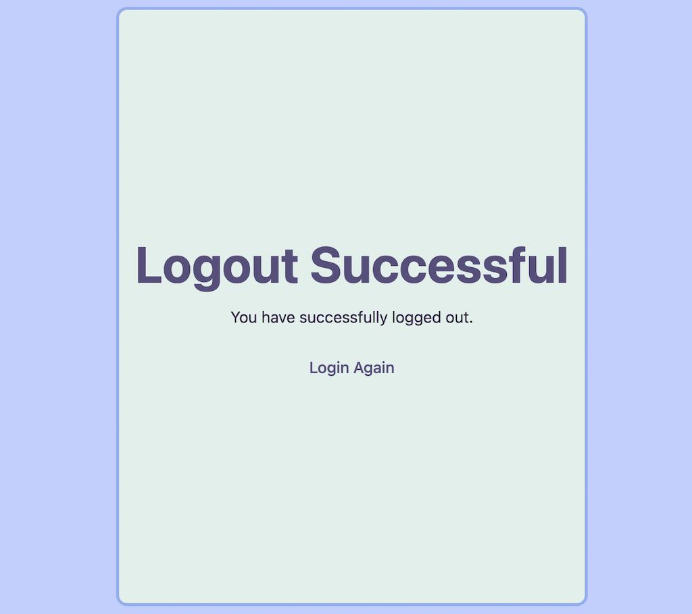

# M2S09

## Exercises using React + Vite: 

Another week full of exercises with Vite and React to create routes using React Router Dom while suing React Hook Form to navigate through Register > Login > Dashboard > Logout. 

### Technologies

- HTML
- CSS
- JavaScript
- React

### Libs

- React Router Dom
- React Hook Form
- Axios
- Yup
- Lucide

---

### Samples

#### Register
<h4 align="center"></4>

#### Login
<h4 align="center"></h4>

#### Dashboard
<h4 align="center"></h4>

#### Logout
<h4 align="center"></h4>